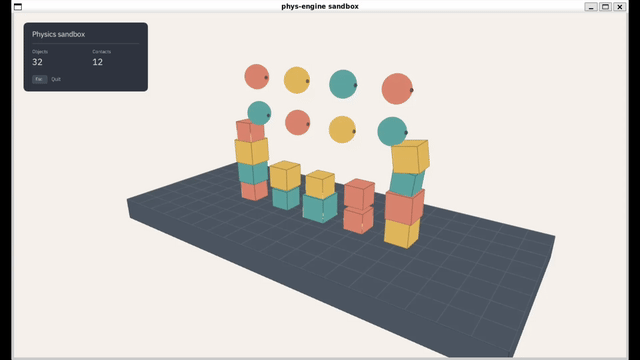

# 3D Physics Engine

Writing a 3D rigid-body physics engine from scratch in C++.



## Bringup
Run `raylib` renderer:
```sh
cmake -S . -B build -DPHYS_BUILD_SANDBOX=ON
cmake --build build --target phys_sandbox
./build/phys_sandbox
```

For benchmarking:
```sh
cmake -S . -B build/release-bench -DCMAKE_BUILD_TYPE=Release \
  -DPHYS_BUILD_SANDBOX=OFF -DPHYS_BUILD_BENCHMARKS=ON

cmake --build build/release-bench --target phys_collision_bench -j 4
./build/release-bench/phys_collision_bench
```

## Sleeping and Waking

Sleeping is opt-in and works with all three broadphase backends:

```cpp
world.setSleepingEnabled(true);
if (auto *body = world.getBody(handle)) {
    bool sleeping = body->isSleeping();
    body->applyLinearImpulse({1, 0, 0});     // Automatically wakes the body.
}
```

## Pipeline

```text
PhysicsWorld::step(dt)
    |
    v
Integrate forces into linear / angular velocities
    |
    v
Update collider world transforms and AABBs
    |
    v
Broad phase -> candidate pairs
    |
    v
Narrow phase -> contact manifolds
    |
    v
Constraint solver -> corrected velocities
    |
    v
Integrate positions / orientations
```

See [architecture](docs/architecture.md),
[collision pipeline](docs/collision_pipeline.md), and the concise
[performance optimization history](docs/performance_optimizations.md) for
intended boundaries, open decisions, and retained performance work.

## Roadmap

| Stage | Scope |
| --- | --- |
| V0 | Basic math, rigid bodies, gravity, semi-implicit Euler; then a simple debug renderer |
| V1 | Spheres, AABBs, sphere-sphere contacts, basic impulse response |
| V2 | Oriented boxes, SAT, angular dynamics, inertia, friction, multi-point manifolds |
| V3 | Improved broad phase, sequential impulses, stable stacking, instrumentation |
| V4 | Evaluate continuous collision detection and other differentiators; GJK + EPA and an experimental dynamic AABB tree are implemented |
